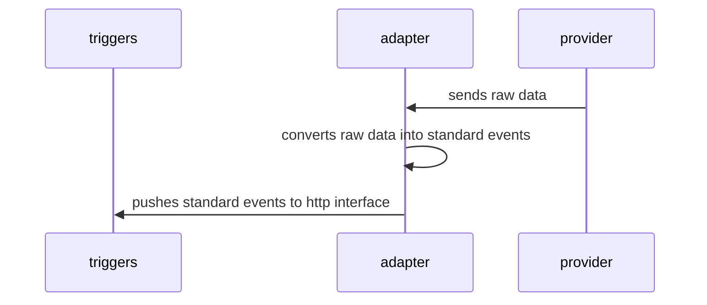
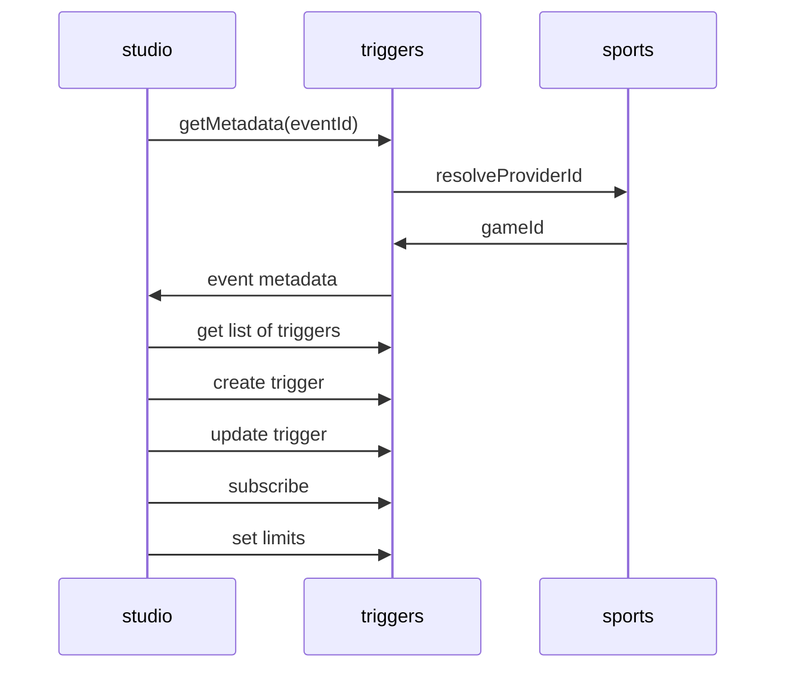
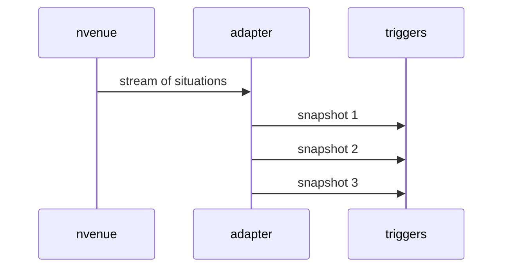
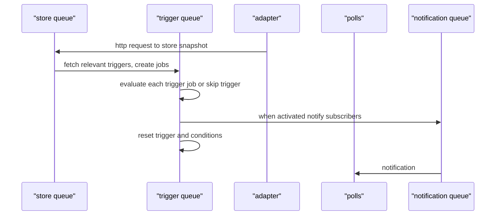

### The general layout of sl-triggers system



### Snapshots

All snapshots are stored as json in Redis and indexed over pre-defined fields, 
refer /src/sports/{sport}/redis-index.ts for indexing, like:
```ts
import { getIndexName, getIndexPrefix } from '../../repositories/scope-snapshot.collection'
import { Sport }  from '../../models/events/sport'

import { BasketballEvents } from './basketball-events'

const sport = Sport.Basketball
const scope = 'game'

export function getIndexQuery(datasource: string, scopeId: string) {
  const prefix = getIndexPrefix(datasource, sport, scope, scopeId)
  const name = getIndexName(datasource, sport, scope, scopeId)

  return [
    'ft.create', name, 'on', 'json', 'prefix', '1', prefix,
    'schema', '$.id', 'as', 'id', 'tag',
    '$.timestamp', 'as', 'timestamp', 'numeric', 'sortable',
    `$.options["${ BasketballEvents.TeamScores3FG }"]`, 'as', 'team_scores_3fg', 'tag',
    `$.options["${ BasketballEvents.Team }"]`, 'as', 'team', 'tag',
    `$.options["${ BasketballEvents.PlayerScores3FG }"]`, 'as', 'player_scores_3fg', 'tag',
    `$.options["${ BasketballEvents.Player }"]`, 'as', 'player', 'tag',
    '$.events', 'as', 'events', 'tag'
  ]
}
```

The name of indices defined here, can be used in aggregation event definition.

### Trigger structure

Trigger is a list of conditions and each condition has the standard event and 
its expected target value to be sought and compare.
All conditions inside the trigger are concurrent, in other words they all should happen at
the same time and should be captured in a single snapshot.
The trigger is considered as activated when all conditions inside it are satisfied and resolved to TRUE.
There can be multiple triggers inside moderation which can be joined with OR logic and
if any of them is activated the subscriber will be notified.
Trigger is stored in Redis database.

Trigger belongs to an entity. In case of Studio the current implementation
assumes that entity is moderation. However, the owner entity can be
any object, e.g. studio event, single question, etc. 
Entity is specified by { entity, entityId } pair inside trigger.

```json
{
    "data": {
        "id": "3b25f2f5-fe6c-4a97-a66d-46ef480e3be6",
        "type": "trigger",
        "attributes": {
            "conditions": [
                {
                    "targets": [
                        "CLE"
                    ],
                    "log": [],
                    "options": [
                        {
                            "targets": [
                                "ball"
                            ],
                            "event": "baseball.pitch.outcomes",
                            "compare": "in",
                            "type": "string",
                            "parent": ""
                        },
                        {
                            "targets": [
                                "CLE"
                            ],
                            "event": "baseball.team.pitcher",
                            "compare": "in",
                            "type": "string",
                            "parent": ""
                        }
                    ],
                    "id": "60f76085-59bf-45ea-a913-0474963996d1",
                    "activated": false,
                    "event": "baseball.team.pitcher",
                    "datasource": "nvenue",
                    "compare": "in",
                    "chain_operation": "and"
                }
            ],
            "limits": {
                "scope": 1
            },
            "counts": {
                "scope": 0,
                "minute": 0
            },
            "trigger": {
                "id": "3b25f2f5-fe6c-4a97-a66d-46ef480e3be6",
                "name": "Trigger",
                "description": "Trigger description",
                "scope": "game",
                "scope_id": "7ccc2979-a9d6-49a4-be47-98a574109996-20240206",
                "activated": false,
                "entity": "question",
                "entity_id": "76938",
                "disabled": false,
                "threshold": 0,
                "disabled_entity": false,
                "use_entity_limits": false,
                "use_condition_threshold": false
            }
        }
    }
}
```



Event metadata is built with a static glossary stored in /games/{provider}/{sport}/games folder.
Current implementation with nVenue requires a manual upload of games.json, players.json, teams.json files. Please note 
that players.json and teams.json are legacy, and not used. Instead, the team and player information
are served from mlb provider folder. They are easily obtained by mlb datasource:
```ts
const mlb = new MlbDatasource()
await mlb.exportPlayersToFile("2023", path.resolve(__dirname, '../games/mlb/players.json'))
await mlb.exportTeamsToFile("2023", path.resolve(__dirname, '../games/mlb/teams.json'))
```
(see here https://github.com/StreamLayer/sl-triggers/blob/d1d8f0d2c7e4168c62f0a9a19f4902e0f69be692/unit/07-metadata-service.test.ts#L26)

The provider, the current is nVenue, sends a stream of sporting events. The event
describes the situation in the field.
The adapter prepares the snapshot by parsing game stream chunks.
While each provider might have its very own set of events and the nomenclature to describe 
the game situation, the role of the adapter is to project this custom signaling 
onto a standard set of events for the sport. 
The standard sets of events for the sports are kept in
/src/sports/{sport} folder. The events are unique strings like
'baseball.player.batter', 'baseball.player.pitcher', 'baseball.team.batter', etc. See
BaseballEvents enumeration in /src/sports/baseball/baseball-events.ts for a complete list.
Each event can be added as a trigger option. File metadata.ts describes the event,
and provides all the necessary data for the studio to draw the UI. E.g. event that has multiple
options from a pre-defined range, or a set, should be drawn in the studio as select, or multi-select, and so on.





### Snapshot processing

#### QueueService
- store queue, one worker
- trigger queue, one worker
- notification queue, one worker

#### AdapterService
- redis as storage (the repository pattern is used here to abstract storage function)
- bullmq as processing queues



### Looping 

When trigger is activated it adds a job to notification queue and
gets back into initial state, ready to listen for snapshots. Trigger and condition states are reset together. 
Notification job is sent to subscribers (e.g. polls) with 
predefined payload, set by Studio in .
Each notification has flag "next", which tells subscribers 
if the notification be ongoing (next = true), or it is the final notification of the trigger (next = false).

### Limitations

#### Entity-level limits
Acts upon all triggers in entity. This type of limits accounts for 
activations of any trigger assigned to same entity. 
Can be enabled by "useEntityLimits" flag inside trigger.

#### Trigger-level limits
Acts within single trigger. Accounts for activation of events
Can be enabled by "useLimits" flag inside trigger.

Both entity-level and trigger-level limits are divided into two subsets:

#### Common limits (valid for all kind of sports):
- limit per scope (e.g. limit per game)
- limit per minute (i.e. limit of trigger per 1 minute interval)

#### Sport-specific limits by standard event 
- defined in /src/sports/{sport}/limits.ts.

Sport-specific limits are based upon standard event name. Each time 
the trigger is executed then the limit counter is increased. 

Trigger looping is restricted by counting number of trigger activations per limit.
E.g. there can be 2 activations per inning, or 1 activation per game, or 10 activations per minute, etc. 

Example of limits defined by Studio in optional section "limits" in TriggerCreateRequest.
```json
{
    "trigger": {        
        "name": "Trigger for pitcher and outcome",        
        "datasource": "nvenue",
        "scope": "game",        
        "scope_id": "750dc887-ff56-4c36-b5c8-670fc50fb682",    
        "entity": "question",
        "entity_id": "69048",
        "use_limits": true
    },
    "conditions": [        
        {
            "targets": [
                "7"
            ],   
            "event": "baseball.inningNumber",            
            "compare": "eq",
            "options": [
                {
                    "event": "baseball.atbat.outcomes",
                    "compare": "in",
                    "targets": ["B1"],
                    "parent": "baseball.team.batter"
                },
                {
                    "event": "baseball.team.batter",
                    "compare": "in",
                    "targets": ["NYY"]                    
                }
            ]        
        }     
    ],
    "limits": {        
        "scope": 1
    }
}
```

When trigger is fetched by Studio current counters are indicated in "count" section:
```json
{
    "data": {
        "id": "3b25f2f5-fe6c-4a97-a66d-46ef480e3be6",
        "type": "trigger",
        "attributes": {
            "conditions": [
                {
                    "targets": [
                        "CLE"
                    ],
                    "log": [],
                    "options": [
                        {
                            "targets": [
                                "ball"
                            ],
                            "event": "baseball.pitch.outcomes",
                            "compare": "in",
                            "type": "string",
                            "parent": ""
                        },
                        {
                            "targets": [
                                "CLE"
                            ],
                            "event": "baseball.team.pitcher",
                            "compare": "in",
                            "type": "string",
                            "parent": ""
                        }
                    ],
                    "id": "60f76085-59bf-45ea-a913-0474963996d1",
                    "activated": false,
                    "event": "baseball.team.pitcher",
                    "datasource": "nvenue",
                    "compare": "in",
                    "chain_operation": "and"
                }
            ],
            "limits": {
                "scope": 1
            },
            "counts": {
                "scope": 0,
                "minute": 0
            },
            "trigger": {
                "id": "3b25f2f5-fe6c-4a97-a66d-46ef480e3be6",
                "name": "Trigger",
                "description": "Trigger description",
                "scope": "game",
                "scope_id": "7ccc2979-a9d6-49a4-be47-98a574109996-20240206",
                "activated": false,
                "entity": "question",
                "entity_id": "76938",
                "disabled": false,
                "threshold": 0,
                "disabled_entity": false,
                "use_entity_limits": false,
                "use_condition_threshold": false
            }
        }
    }
}
```

### Simple and aggregation events

#### Simple event 
Looks like key-value pair and provided in snapshot by sport data provider. 
E.e. "inningNumber": 7, or "inningHalf": "top"; "player": "{playerID}" etc.

#### Aggregation event

Current implementation is defined only for basketball. However, this type
of event is applicable to any sport. Should be defined in /src/sports/{sport}/metadata.ts
via "aggregate" property using Redis Stack syntax to query.
Example of aggregation: to count a number of events like Player A 
makes a score since start of the game.
```ts
{
  [BasketballEvents.PlayerScores3FG]: {
    sport: 'basketball',
    input: StudioInputs.Number,
    primary: false,
    label: 'Player Scores X 3FG',
    description: 'e.g. Steph Curry hits 5th 3FG',
    type: ConditionType.String,
    compare: [
      CompareOp.Equal
    ],
    targets: [],
    parentOption: BasketballEvents.Player,
    aggregate: (datasource, sport, scope, scopeId, targets) => {
      const result = [
        'ft.aggregate', getIndexName(datasource, sport, scope, scopeId),
        // query tag "events" with PlayerScores3FG option
        `'@events:{ ${ escape(BasketballEvents.PlayerScores3FG) } }'`,
        // group those events by Player option
        'groupby', '1', '@player',
        // count size of the group
        'reduce', 'count', '0', 'as', 'count',
        // select only groups matching targets of interest
        ...filter('@player', [...targets], '||')
      ] as any[]

      if (targets.length > 1) {
        // if we have multiple targets we should sum their sizes (analogue of OR)
        result.push([
          'groupby', '0',
          // sum over field "count" from previous operations and mark result as "count"
          'reduce', 'sum', '1', 'count', 'as', 'count'
        ])
      }

      return result
    },
  }
}
```

