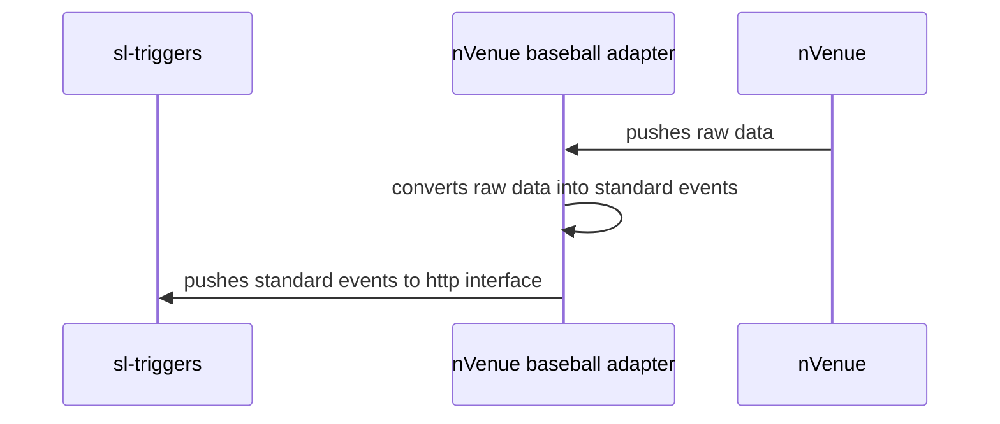

## Adapter workflow



I never had a chance to work with nVenue, so I presume it might be similar to Sportradar, which we used 
as a prototype of the data provider.

So let's assume nVenue sends a stream of raw events during the game. Each is a snapshot of the game at some position in time.
The snapshot have a complete description of concurrent game "in-time" statistics, inning, player action and results of player/team actions.
This data is tangled with nVenue internal logic and differs from pre-built format of sl-triggers service.
So it needs to be converted into a suitable form.

To achieve that this game "in-time" snapshot is consumed by adapter and distilled into a set of well-defined standard events like 
```js
  'baseball.team'
  'baseball.player'
  'baseball.player.atbat'
  'baseball.player.pitch'
  'baseball.team.atbat'
  'baseball.team.pitch'
  'baseball.game.state'
  'baseball.pitch.outcome'
  'baseball.ball.speed'
  'baseball.atbat.outcome'
  'baseball.inning' 
  'baseball.score.differential'
  'baseball.score.home'
  'baseball.score.away'
```
Note: *I used BaseballChain sheet from "https://docs.google.com/spreadsheets/d/1YBeSAcBpC596bcqI0M_mkXIqGHSMgbGh4myCF4Er89k/edit#gid=282295928"
to draw this up, and added some extras like "baseball.ball.speed". List of standard events is open and can be extended.*

So each game stats snapshot document pushed by nVenue is transformed by adapter into a internal document like: 

```js
// Outcome of the adapter
{
        "id": "{{ unique snapshot id }}",
        "datasource": "nvenue",
        "sport": "baseball",
        "scope": "game",
        "scopeId": "{{ game id }}",
        "timestamp": 1664669613000,
        "options": {
            "baseball.inning": 1,
            "baseball.team": "{{ team id as defined by nVenue nomenclature }}",
            "baseball.player": "{{ player id as defined by nVenue nomenclature  }}",
            "baseball.player.atbat": "{{ player id... }}",
            "baseball.atbat.outcome": "HIT",
            "baseball.score.home": 0, 
            "baseball.score.away": 1,
            "baseball.score.differential": 1,
            "baseball.game.state": "inning.start"
        }
    }
```

This outcome document is pushed into http interface of sl-triggers. Of course, transforming is not always a simple mapping
and would require tackling the game logic in order to separate the event of interest from raw data. 

For illustration purpose I add the definition of events as defined in sl-triggers service.
This constants should be used by both sides (sl-triggers and nVenue baseball adapter). 
Same, list is open for updates and modifications.

```js
export enum GameState {
  GameStart = 'game.start',
  GameEnd = 'game.end',
  InningStart = 'inning.start',
  InningEnd = 'inning.end'
}

export enum PitchOutcomeState {
  GT99 = 'gt.90',
  LT80 = 'lt.80',
  Ball = 'ball',
  StrikeLooking = 'strike_looking',
  StrikeSwinging = 'strike_swinging',
  BallInPlay = 'ball_in_play',
  Foul = 'foul'
}

export enum AtBatOutcomeState {
  HIT = 'HIT',
  X1 = 'X1',
  X2 = 'X2',
  X3 = 'X3',
  HR = 'HR',
  XBH = 'XBH',
  BB = 'BB',
  HBP = 'HBP',
  REACH = 'REACH',
  ERR = 'ERR',
  CI = 'CI',
  RBI = 'RBI',
  OUT = 'OUT',
  K = 'K',
  KL = 'KL',
  KS = 'KS',
  IPO = 'IPO',
  FO = 'FO',
  GO = 'GO',
  GIDP = 'GIDP',
  BI = 'BI'
}

export enum BaseballEvents {
  Team = 'baseball.team', // refers team id
  Player = 'baseball.player', // refers player id
  PlayerAtBat = 'baseball.player.atbat', // refers player id
  PlayerPitch = 'baseball.player.pitch', // refers player id
  TeamAtBat = 'baseball.team.atbat',
  TeamPitch = 'baseball.team.pitch',
  GameState = 'baseball.game.state',
  PitchOutcome = 'baseball.pitch.outcome',
  BallSpeed = 'baseball.ball.speed',
  AtBatOutcome = 'baseball.atbat.outcome',
  Inning = 'baseball.inning',
  ScoreDifferential = 'baseball.score.differential',
  HomeScore = 'baseball.score.home',
  AwayScore = 'baseball.score.away'
}
```


### Case study: Sportradar adapter

There is a ready sportradar adapter (https://github.com/kristobalus/sportradar-adapter) 
with basketball service (https://github.com/kristobalus/sportradar-adapter/blob/7553557b4bee2c385d106d006d45db713b5e3e3f/src/services/basketball.service.ts#L23)
which does just the same job: converts the raw in-time snapshots from Sportradar 
into well-defined standard events. This might be helpful. 

```js
// This is example of outcome of the adapter 
{
  "id": "c74082f3-b53a-407e-989c-927468c1314b",
  "datasource": "sportradar",
  "sport": "basketball",
  "scope": "game",
  "scopeId": "d8539eb6-3e27-40c8-906f-9cd1736321d8",
  "timestamp": 1664669448000,
  "options": {
    "basketball.game.points.home": 0,
    "basketball.game.points.away": 0,
    "basketball.game.sequence": 1,
    "basketball.game.quarter": 1,
    "basketball.game.period": "fece1ac0-b703-4478-8a7c-3f27313dec97",
    "basketball.game.points.total": 0
  }
}
```

```js
// and this is how the raw Sportradara snapshot looks like for
// real in-game in-time snapshot of Sportradar's NBA simulation
{
    "payload": {
        "game": {
            "id": "d8539eb6-3e27-40c8-906f-9cd1736321d8",
            "status": "inprogress",
            "coverage": "full",
            "reference": "0012200003",
            "scheduled": "2022-10-02T00:00:00+00:00",
            "home": {
                "name": "Bucks",
                "market": "Milwaukee",
                "reference": "1610612749",
                "id": "583ecefd-fb46-11e1-82cb-f4ce4684ea4c",
                "points": 0,
                "bonus": false,
                "remaining_timeouts": 7,
                "sr_id": "sr:team:3410"
            },
            "away": {
                "name": "Grizzlies",
                "market": "Memphis",
                "reference": "1610612763",
                "id": "583eca88-fb46-11e1-82cb-f4ce4684ea4c",
                "points": 0,
                "bonus": false,
                "remaining_timeouts": 7,
                "sr_id": "sr:team:3415"
            }
        },
        "event": {
            "id": "c74082f3-b53a-407e-989c-927468c1314b",
            "event_type": "lineupchange",
            "number": 5002,
            "sequence": 1664669447993,
            "clock": "12:00",
            "clock_decimal": "12:00",
            "updated": "2022-10-02T00:10:48Z",
            "wall_clock": "2022-10-02T00:10:48Z",
            "created": "2022-10-02T00:10:48Z",
            "description": "Grizzlies lineup change (Santi Aldama, John Konchar, Ziaire Williams, Brandon Clarke, Kennedy Chandler)",
            "home_points": 0,
            "away_points": 0,
            "attribution": {
                "name": "Grizzlies",
                "market": "Memphis",
                "reference": "1610612763",
                "id": "583eca88-fb46-11e1-82cb-f4ce4684ea4c",
                "sr_id": "sr:team:3415"
            },
            "period": {
                "id": "fece1ac0-b703-4478-8a7c-3f27313dec97",
                "number": 1,
                "sequence": 1,
                "type": "quarter"
            },
            "on_court": {
                "home": {
                    "name": "Bucks",
                    "market": "Milwaukee",
                    "reference": "1610612749",
                    "id": "583ecefd-fb46-11e1-82cb-f4ce4684ea4c",
                    "sr_id": "sr:team:3410",
                    "players": [
                        {
                            "full_name": "Bobby Portis",
                            "jersey_number": "9",
                            "reference": "1626171",
                            "id": "68b7aac9-02fd-4bd8-b10c-6702d2c5eb98",
                            "sr_id": "sr:player:852206"
                        },
                        {
                            "full_name": "Grayson Allen",
                            "jersey_number": "12",
                            "reference": "1628960",
                            "id": "ffa9a64f-d624-4033-bd23-59dcfd805175",
                            "sr_id": "sr:player:1497615"
                        },
                        {
                            "full_name": "Jordan Nwora",
                            "jersey_number": "13",
                            "reference": "1629670",
                            "id": "c7a6b9c5-c600-49d9-b7be-e2b12b464e40",
                            "sr_id": "sr:player:1304640"
                        },
                        {
                            "full_name": "Brook Lopez",
                            "jersey_number": "11",
                            "reference": "201572",
                            "id": "c179fb5c-9845-4e37-aef7-6e00d97548eb",
                            "sr_id": "sr:player:607534"
                        },
                        {
                            "full_name": "Jrue Holiday",
                            "jersey_number": "21",
                            "reference": "201950",
                            "id": "65700e81-3aa0-49a9-8a94-004f2cfb64e5",
                            "sr_id": "sr:player:607876"
                        }
                    ]
                },
                "away": {
                    "name": "Grizzlies",
                    "market": "Memphis",
                    "reference": "1610612763",
                    "id": "583eca88-fb46-11e1-82cb-f4ce4684ea4c",
                    "sr_id": "sr:team:3415",
                    "players": [
                        {
                            "full_name": "Santi Aldama",
                            "jersey_number": "7",
                            "reference": "1630583",
                            "id": "266cd359-f378-45c6-957e-6e21378e5219",
                            "sr_id": "sr:player:1876228"
                        },
                        {
                            "full_name": "John Konchar",
                            "jersey_number": "46",
                            "reference": "1629723",
                            "id": "906578a8-c01e-4799-a972-2b47e02108b9",
                            "sr_id": "sr:player:1826622"
                        },
                        {
                            "full_name": "Ziaire Williams",
                            "jersey_number": "8",
                            "reference": "1630533",
                            "id": "1c9a1c2e-3e3b-439e-8d72-0b41b17e4ba9",
                            "sr_id": "sr:player:2080949"
                        },
                        {
                            "full_name": "Brandon Clarke",
                            "jersey_number": "15",
                            "reference": "1629634",
                            "id": "c978afe7-cf22-45fc-8d0f-da8f867eb5ee",
                            "sr_id": "sr:player:1164396"
                        },
                        {
                            "full_name": "Kennedy Chandler",
                            "jersey_number": "1",
                            "reference": "1631113",
                            "id": "931f7ae2-4ce4-49e6-a3ad-e24790469fec",
                            "sr_id": "sr:player:2218226"
                        }
                    ]
                }
            }
        }
    },
    "locale": "en",
    "metadata": {
        "league": "NBA",
        "match": "sd:match:d8539eb6-3e27-40c8-906f-9cd1736321d8",
        "status": "inprogress",
        "team": "sd:team:583eca88-fb46-11e1-82cb-f4ce4684ea4c,sr:team:3415",
        "players": "sd:player:68b7aac9-02fd-4bd8-b10c-6702d2c5eb98,sd:player:ffa9a64f-d624-4033-bd23-59dcfd805175,sd:player:c7a6b9c5-c600-49d9-b7be-e2b12b464e40,sd:player:c179fb5c-9845-4e37-aef7-6e00d97548eb,sd:player:65700e81-3aa0-49a9-8a94-004f2cfb64e5,sd:player:266cd359-f378-45c6-957e-6e21378e5219,sd:player:906578a8-c01e-4799-a972-2b47e02108b9,sd:player:1c9a1c2e-3e3b-439e-8d72-0b41b17e4ba9,sd:player:c978afe7-cf22-45fc-8d0f-da8f867eb5ee,sd:player:931f7ae2-4ce4-49e6-a3ad-e24790469fec",
        "event_type": "lineupchange",
        "event_category": "lineupchange",
        "locale": "en",
        "operation": "update",
        "version": "v7"
    }
}
```


