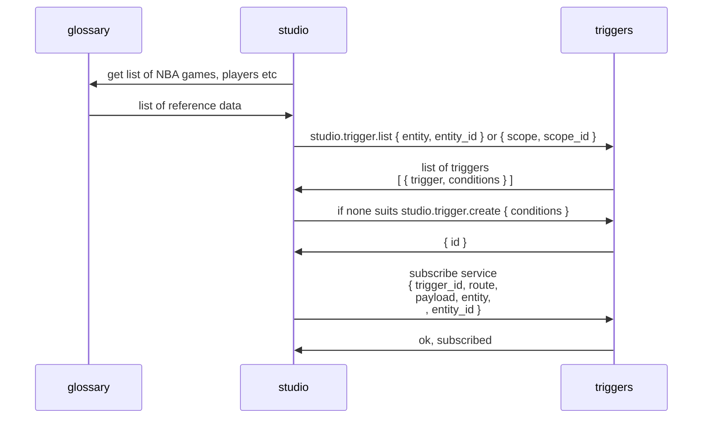

# Table of contents
1. [Datasource](#datasource)
2. [Create and subscribe for trigger](#studio)
3. [Event processing](#event-processing)
4. [Triggers API](#triggers-api)

## Datasource <a name="datasource"></a>


- datasource streams events to adapter
- __adapter__ being aware of the logic of the datasource converts raw data into internal standard events.
- __adapter__ pushes standard events into http interface of __triggers__

Each standard event represents an entity from this table:
https://docs.google.com/spreadsheets/d/1YBeSAcBpC596bcqI0M_mkXIqGHSMgbGh4myCF4Er89k/edit#gid=452767957

All events extend the base standard event
```typescript
export interface Event {
  // unique raw event identifier from datasource
  id: string
  // scope of event
  scope: string
  // unique scope identifier, e.g. d8539eb6-3e27-40c8-906f-9cd1736321d8,
  // adapter takes it from datasource raw data
  scopeId: string
  // event name
  name: string
  // event value
  value: string
  // timestamp, unixtime millis
  timestamp: number
}
```

Example of event derived from Event
```ts
export interface FootballGameLevelEvent extends Event {
  name: FootballEvents.GameLevel
  value: GameLevel
}
```

the event objects will finally look like
```js
{
    id: "ab362b76-b89d-4cd8-80e3-340b048f98c8",
    name: "football.game.level",
    value: "start",
    scope: "sportradar.game",
    scopeId: "d8539eb6-3e27-40c8-906f-9cd1736321d8",
    timestamp: 1686054201993
}
```

## Create and subscribe for trigger <a name="studio"></a>

To use service one should create trigger and subscribe for trigger to be notified of its activation. It is assumed that Studio should be used for this purpose.



- studio fetches datasource nomenclature from glossary to show/create triggers; e.g. "sl-sports" can be used as glossary, since it has sync with __sportradar__;
- studio matches "game.id" of interest from glossary and stores it as __scope__ and __scopeId__ somewhere inside the moderation object;
- studio fetches a list of existing triggers by using { datasource, scope, scopeId};
- if none of the existing triggers suits, studio creates new trigger with certain conditions;
- __studio__ subscribes the destination service (e.g. "polls") for a trigger; to do so __studio__ presents following arguments:
    - callback __route__, e.g. "studio.questions.activate"
    - callback __payload__ to be passed into the route, e.g. _{ id }_ with question id

Trigger is the main entity inside service __triggers__

```ts
interface Trigger {
   // uuid generated for each trigger
   id: string
   // human-readable name just for description purposes
   name: string
   // human-readable name just for description purposes
   description: string
   datasource: "sportradar"
   scope: "game"
   scopeId: string   
   conditions: TriggerCondition[]
}
```

```typescript

interface TriggerCondition {
   // uuid generated for each condition
   id: string
   event: string   
   // comparison operation, should be used to compare "current" and "target" and return a boolean
   compare: "eq","lt","gt","le","ge"   
   // type of condition
   type: "set-and-compare"
   // target value of the event, threshold value to compare with
   target: string | number
   // current value read from event
   current: string | number
   // true when compare(target, current) == true
   activated: boolean
   // log of events consumed by condition
   log: Map<string, Event>
}
```

example of trigger object
```json
{
  "trigger": {
    "name": "...",
    "description": "..",
    "scope": "sportradar.game",
    "scopeId": "c24ad602-2290-4787-9b22-81e4e32dd582",
    "entity": "moderation",
    "entityId": "aebc7224-399d-4d08-876c-8eeab8b42a8f",
    "id": "1696a45b-66be-4a7d-a939-a08fa722f8f2",
    "activated": false
  },
  "conditions": [
    {
      "activated": true,
      "current": "start",
      "compare": "eq",
      "uri": "event://sportradar.games/c24ad602-2290-4787-9b22-81e4e32dd582/football.game.level",
      "target": "start",
      "event": "football.game.level",
      "chainOrder": 0,
      "chainOperation": "and",
      "id": "08ae3940-cbfd-4f4e-9be6-1ea6b8d4d881",
      "log": [
        {
          "id": "183e36c7-9cb1-4edc-9164-c86a9b55f834",
          "name": "football.game.level",
          "value": "start",
          "scope": "sportradar.games",
          "scopeId": "c24ad602-2290-4787-9b22-81e4e32dd582",
          "timestamp": 1687854426302
        }
      ]
    },
    {
      "activated": true,
      "current": "30",
      "compare": "ge",
      "uri": "event://sportradar.games/c24ad602-2290-4787-9b22-81e4e32dd582/football.game.points.home",
      "target": "30",
      "event": "football.game.points.home",
      "chainOrder": 1,
      "chainOperation": "and",
      "id": "144dbdc5-d83c-43b5-b278-1594e64453f3",
      "log": [
        {
          "id": "9401f798-f9c2-4140-9c37-ce610b43f3f1",
          "name": "football.game.points.home",
          "value": "30",
          "scope": "sportradar.games",
          "scopeId": "c24ad602-2290-4787-9b22-81e4e32dd582",
          "timestamp": 1687854426303
        }
      ]
    },
    {
      "compare": "eq",
      "uri": "event://sportradar.games/c24ad602-2290-4787-9b22-81e4e32dd582/football.player.state/player/dae23dc8-1912-4308-8ed7-993776246936",
      "target": "touchdown",
      "event": "football.player.state",
      "chainOrder": 2,
      "chainOperation": "and",
      "params": {
        "player": "dae23dc8-1912-4308-8ed7-993776246936"
      },
      "id": "49135ab0-f4d7-4dec-b9f9-678c241b5543",
      "activated": false,
      "log": []
    }
  ]
}
```

When trigger is created, it is stored in collection "triggers" as __redis hash__.
```yaml
triggers/{trigger-id as uuid}:   
   id: "{uuid}",
   name: "home points 30+"
   description: "should trigger when home points reach 30 or more"
   datasource: "sportradar"
   scope: "game"
   scopeId: "d8539eb6-3e27-40c8-906f-9cd1736321d8"
```

Trigger conditions are stored into separate collection "triggers/conditions" as __redis hash__.
```yaml
triggers/{trigger-id as uuid}/conditions/{condition-id as uuid}:
   id: "{uuid}"
   event: "game.home_points"
   compare: "ge"
   target: 30
   type: "set-and-compare"
   current: 0
```

Every event consumed by trigger condition is stored in the log collection as __redis hash__
```yaml
triggers/{trigger-id as uuid}/conditions/{condition-id as uuid}/logs:
   "event_id {uuid}": "{ JSON document of the event }"
   ... as many rows as events received while condition is listening...
```

The list of conditions are linked to a trigger as __redis set__.
```yaml
triggers/{trigger-id}/conditions:      
   - "condition-id-1 as {uuid}"
   - "condition-id-2 as {uuid}"
   ...
```

Trigger is added into event subscribers as __redis set__.
```yaml
events/{event-name}/subscribers:      
   - "trigger-id-1 as {uuid}"
   - "trigger-id-2 as {uuid}"
   ...
```

When trigger is created it can be subscribed. Trigger subscribers are notified upon trigger activation. To create a subscription __studio__ passes subscription object in the request "triggers.subscribe"
```ts
interface TriggerSubsription {
   // uuid generated on create
   id: string
   // linked trigger
   triggerId: string  
   // name of destination service, e.g. "polls"
   service: string
   // entity, e.g. "question"
   entity: string
   // entity id
   entityId: string
   route: string
   payload: object
}
```

Trigger subscription is stored as __redis hash__.
```yaml
triggers/{trigger-id as uuid}/subscriptions/{subscription-id as uuid}:
   id: "subscription {uuid}"
   triggerId: "trigger {uuid}"
   service: "polls"
   entity: "question"
   entityId: "123"
   route: "studio.questions.activate"
   payload: "{ JSON of payload object }"
```

To match subscription to trigger its ID is stored in __redis set__ collection under the trigger-id key.
```yaml
triggers/{trigger-id as uuid}/subscriptions:
   - "subscription-id-1 as {uuid}"
   - "subscription-id-2 as {uuid}"
   ...
```

Also, to search for subscriptions by entity, entity_id or service
we should use __RedisSearch__ extension.


## Event processing <a name="event-processing"></a>


diagram description:
- __adapter__ pushes standard events into http interface of __triggers__


When event __"game.home_points"__ is received from adapter,
```js
{
   datasource: "sportradar",
   scope: "game",
   scopeId: "d8539eb6-3e27-40c8-906f-9cd1736321d8",
   id: "ab362b76-b89d-4cd8-80e3-340b048f98c8",
   name: "game.home_points",         
   value: 10,
   timestamp: 1686054201993
}
```
it has a list of _ids_ of subscribed triggers
```
SMEMBERS events/game.home_points/subscribers
```


We fetch a trigger by ID and apply event on the trigger. To do so, we proceed with the flow:
- get a list of conditions for the trigger
  ```
  SMEMBERS triggers/{trigger-id}/conditions
  ```

- for each condition one should run lua script according to condition's "type" field, e.g. for _{ type: "set-and-compare" }_ run lua script which should:
    - set __current__ value to _10_ replacing the old one
    - compare __current__ and __target__ values and store bool result into __activated__ , e.g condition.activated = condition.target >= condition.current
    - put event JSON into log collection
    - return condition state __activated__ in the result

There are as many Lua scripts as conditions types, e.g:
- set-and-compare: to store current value passed by the event and compare with target value
- incr-and-compare: to increment some accumulator and compare with target value

Collect results of _all conditions_ inside the _trigger_.

If all conditions are activated then the __trigger becomes activated__. And here we should notify all trigger subsribers about it.

we take a list of subsription IDs from
```
SMEMBERS triggers/{trigger-id as uuid}/subscriptions
```
get the subscription by ID
```
HGETALL triggers/{trigger-id as uuid}/subscriptions/{subscription-id as uuid}
```
e.g.
```js
{   
   id: "{uuid}"   
   triggerId: "{uuid}"   
   service: "polls",   
   entity: "question",   
   entityId: "123",
   route: "studio.questions.activate",
   payload: { id: 123 }
}
```

and send message to __route__ = "studio.questions.activate"
with __payload__ = _{ id: 123 }_

After all subscribers are notified we should do a clean up and remove trigger and related entities.

# Triggers API <a name="triggers-api"></a>

## "triggers.create"
Creates trigger.

```ts
interface Trigger {
   // uuid generated for each trigger
   id: string
   // human-readable name just for description purposes
   name: string
   // human-readable name just for description purposes
   description: string
   datasource: "sportradar"
   scope: "game"
   scopeId: string   
   conditions: TriggerCondition[]
}
```

## "triggers.list"
List of triggers by {scope, scopeId} or other fields.
__RedisSearch__ is used to match hash fields in trigger object.

## "triggers.subscribe"
Subscribes for trigger.

```ts
interface TriggerSubsription {
   // uuid generated on create
   id: string
   // linked trigger
   triggerId: string  
   // name of destination service, e.g. "polls"
   service: string
   // entity, e.g. "question"
   entity: string
   // entity id
   entityId: string
   route: string
   payload: object
}
```

## "triggers.subscriptions.list"
Fetches a list of subscriptions by entity, entityId, triggerId or other hash fields.

__RedisSearch__ is used to match hash fields.

## TODO
